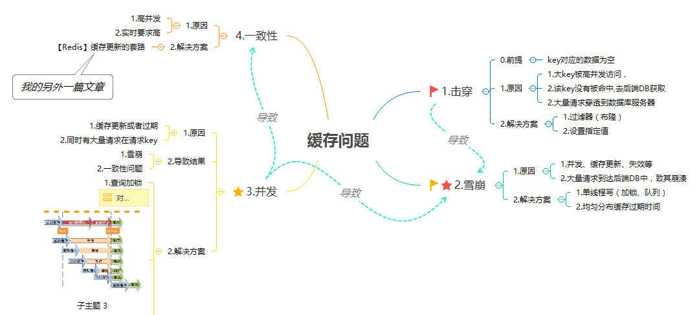

# 什么是缓存？
缓存，就是数据交换的缓冲区，针对服务对象的不同（本质就是不同的硬件）都可以构建缓存。

目的是，**把读写速度慢的介质的数据保存在读写速度快的介质中，从而提高读写速度，减少时间消耗。** 例如：

- CPU 高速缓存 ：高速缓存的读写速度远高于内存。
    - CPU 读数据时，如果在高速缓存中找到所需数据，就不需要读内存
    - CPU 写数据时，先写到高速缓存，再回写到内存。
- 磁盘缓存：磁盘缓存其实就把常用的磁盘数据保存在内存中，内存读写速度也是远高于磁盘的。
    - 读数据时，从内存读取。
    - 写数据时，可先写到内存，定时或定量回写到磁盘，或者是同步回写。

# 为什么要用缓存？
使用缓存的目的，就是提升读写性能。而实际业务场景下，更多的是为了提升读性能，带来更好的性能，更高的并发量。

日常业务中，我们使用比较多的数据库是 MySQL，缓存是 Redis 。Redis 比 MySQL 的读写性能好很多。那么，我们将 MySQL 的热点数据，缓存到 Redis 中，提升读取性能，也减小 MySQL 的读取压力。例如说：

- 论坛帖子的访问频率比较高，且要实时更新阅读量，使用 Redis 记录帖子的阅读量，可以提升性能和并发。
- 商品信息，数据更新的频率不高，但是读取的频率很高，特别是热门商品。

# 分布式缓存系统面临的问题

## 缓存与数据库双写不一致
一般来说，如果允许缓存可以稍微的跟数据库偶尔有不一致的情况，也就是说如果你的系统不是严格要求 “缓存+数据库” 必须保持一致性的话，最好不要做这个方案，即：读请求和写请求串行化，串到一个内存队列里去。

串行化可以保证一定不会出现不一致的情况，但是它也会导致系统的吞吐量大幅度降低，用比正常情况下多几倍的机器去支撑线上的一个请求。

最经典的就是**缓存+数据库读写**的模式(Cache Aside Pattern)。

- 读的时候，先读缓存，缓存没有的话，再读数据库，然后取出数据后放入缓存，同时返回响应。
- 更新的时候，先更新数据库，然后再删除缓存。
