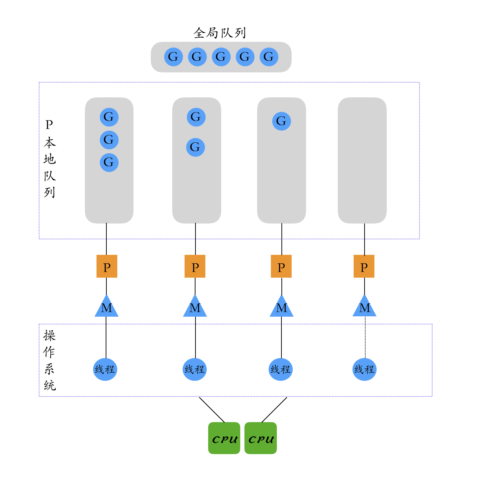

<!-- TOC -->
* [init和main函数相关特点](#init和main函数相关特点)
* [Slice](#slice)
  * [slice扩容原理](#slice扩容原理)
  * [Go 中对 nil 的 Slice 和空 Slice 的处理是一致的吗?](#go-中对-nil-的-slice-和空-slice-的处理是一致的吗)
  * [数组与切片的区别](#数组与切片的区别)
* [map相关](#map相关)
  * [map是否线程安全](#map是否线程安全)
  * [map循环是有序的还是无序的](#map循环是有序的还是无序的)
  * [map 中删除一个 key，它的内存会释放么？](#map-中删除一个-key它的内存会释放么)
  * [map 的数据结构是什么？是怎么实现扩容？](#map-的数据结构是什么是怎么实现扩容)
  * [map 的 key 可以是什么类型？](#map-的-key-可以是什么类型)
* [defer](#defer)
  * [defer的执行顺序](#defer的执行顺序)
  * [Go struct 能不能比较](#go-struct-能不能比较)
  * [new和make的区别](#new和make的区别)
* [Channel](#channel)
  * [为什么Channel可以做到线程安全？](#为什么channel可以做到线程安全)
  * [Channel 是同步的还是异步的？](#channel-是同步的还是异步的)
* [GPM模型](#gpm模型)
* [进程、线程、协程](#进程线程协程)
  * [协程和线程和进程的区别？](#协程和线程和进程的区别)
  * [Goroutine 和线程的区别](#goroutine-和线程的区别)
  * [为什么协程比线程更轻量](#为什么协程比线程更轻量)
* [Go 语言函数传参是值类型还是引用类型？](#go-语言函数传参是值类型还是引用类型)
  * [两个 interface 可以比较吗？](#两个-interface-可以比较吗)
<!-- TOC -->

# init和main函数相关特点
* init函数（没有输入参数、返回值）的主要作用：
  - 在程序运行前对变量进行初始化、检查、注册等工作。
  - 实现sync.Once功能。
* init 顺序
  - 在同一个 package 中，可以多个文件中定义 init 方法
  - 在同一个 go 文件中，可以重复定义 init 方法
  - 在同一个 package 中，不同文件中的 init 方法的执行按照文件名先后执行各个文件中的 init 方法
  - 在同一个文件中的多个 init 方法，按照在代码中编写的顺序依次执行不同的 init 方法
  - 对于不同的 package，如果不相互依赖的话，按照 main 包中 import 的顺序调用其包中的 init() 函数
  - 如果 package 存在依赖，调用顺序为最后被依赖的最先被初始化，例如：导入顺序 main –> A –> B –> C，则初始化顺序为 C –> B –> A –> main，一次执行对应的 init 方法。

* 所有 init 函数都在同⼀个 goroutine 内执行。
* 所有 init 函数结束后才会执行 main.main 函数

# Slice
## slice扩容原理
* slice 是一个引用类型，底层是一个数组，slice 本身只是一个引用，指向底层数组的某个位置，slice 本身不存储任何数据。
* slice的扩容策略是：当 slice 的容量不足时，会自动扩容，扩容的策略是：如果原 slice 的长度小于 1024，则新 slice 的容量是原 slice 的 2 倍；如果原 slice 的长度大于等于 1024，则新 slice 的容量是原 slice 的 1.25 倍。
* demo
```go
func TestSlice(t *testing.T) {
	m1 := []int{1, 2, 3, 4, 5, 6, 7, 8, 9, 10}

	m2 := m1[3:7]
	fmt.Println(m2, cap(m2))

	m2 = append(m2, 12)
	fmt.Println(m1)
	fmt.Printf("m1:%d; m2:%d; \n", cap(m1), cap(m2))

	m1 = append(m1, 11)
	fmt.Println(cap(m1))
}
```
* 执行结果：
  - [4 5 6 7] 7
  - [1 2 3 4 5 6 7 12 9 10]
  - m1:10; m2:7; 
  - 20

```shell
go test -v ../coding/basic_test.go -run TestSlice
```

## Go 中对 nil 的 Slice 和空 Slice 的处理是一致的吗?
* nil 切片和空切片是不同的，nil 切片是一个 nil 的指针，指向的内存地址是 nil，而空切片是一个指向数组的指针，但是数组的长度和容量都是 0。

## 数组与切片的区别
* 数组是值类型；切片是引用类型，切片底层是一个结构体，包含三个字段：指向底层数组的指针、切片的长度和切片的容量。
* 数组的长度是固定的，只能存储同类型的数据结构，切片的长度是可变的，可以动态扩容

# map相关

## map是否线程安全
* map 是非线程安全的，如果多个 goroutine 并发读写 map，会导致数据竞争，从而导致程序崩溃。
* 如果需要在多个 goroutine 中读写 map，可以使用 sync.Map，sync.Map 是线程安全的。

## map循环是有序的还是无序的
无序的, map 因扩张⽽重新哈希时，各键值项存储位置都可能会发生改变，顺序自然也没法保证了，所以官方避免大家依赖顺序，直接打乱处理。就是 for range map 在开始处理循环逻辑的时候，就做了随机播种

## map 中删除一个 key，它的内存会释放么？
* 如果删除的元素是值类型，如int，float，bool，string以及数组和struct，map的内存不会自动释放 
* 如果删除的元素是引用类型，如指针，slice，map，chan等，map的内存会自动释放，但释放的内存是子元素应用类型的内存占用 
* 将map设置为nil后，内存被回收

## map 的数据结构是什么？是怎么实现扩容？
golang 中 map 是一个 kv 对集合。底层使用`hash table`，用链表来解决冲突，出现冲突时，不是每一个 key 都申请一个结构通过链表串起来，而是以 bmap 为最小粒度挂载，一个 bmap 可以放 8 个 kv。在哈希函数的选择上，会在程序启动时，检测 cpu 是否支持 aes，如果支持，则使用 aes hash，否则使用 memhash。每个 map 的底层结构是 hmap，是有若干个结构为 bmap 的 bucket 组成的数组。每个 bucket 底层都采用链表结构。

## map 的 key 可以是什么类型？
* map 的 key 可以是任何类型，包括指针、结构体、数组、字符串等(boolean, int, float, string, pointer, channel, interface, structs, array)，但是 key 必须是可比较的。
* map 的 key 不能是 slice、map、function，因为这三种类型的元素是不可比较的。

# defer
## defer的执行顺序
* 作用：defer延迟函数，释放资源，收尾工作；如释放锁，关闭文件，关闭链接；捕获panic;
* 避坑指南：defer函数紧跟在资源打开后面，否则defer可能得不到执行，导致内存泄露。
* 多个 defer 调用顺序是 LIFO（后入先出），defer后的操作可以理解为压入栈中
```go   
func calc(index string, a, b int) int {
   ret := a + b
   println(index, a, b, ret)
   return ret
}

func main() {
  a := 1
  b := 2
  defer calc("1", a, calc("10", a, b))
  a = 0
  defer calc("2", a, calc("20", a, b))
  b = 1
}
```
```shell
go run ../coding/defer_demo.go
```

## Go struct 能不能比较
* 需要具体情况具体分析，如果struct中含有不能被比较的字段类型，就不能被比较； 如果struct中所有的字段类型都支持比较，那么就可以被比较。
* 不可被比较的类型：
  - slice，因为slice是引用类型，除非是和nil比较
  - map，和slice同理，如果要比较两个map只能通过循环遍历实现
  - 函数类型
* 其他的类型都可以比较。
* 还有两点值得注意：
  - 结构体之间只能比较它们是否相等，而不能比较它们的大小 
  - 只有所有属性都相等而且属性顺序都一致的结构体才能进行比较

## new和make的区别
* make和new都是golang用来分配内存的內建函数，且在堆上分配内存，make 即分配内存，也初始化内存。new只是将内存清零，并没有初始化内存。 
* make返回的还是引用类型本身；而new返回的是指向类型的指针。 
* make只能用来分配及初始化类型为slice，map，channel的数据；new可以分配任意类型的数据。


# Channel

## 为什么Channel可以做到线程安全？
* channel 是 Go 语言运行时提供的一种数据结构，channel 是线程安全的，channel 内部实现了互斥锁，保证了 channel 的并发安全性。
* Channel 可以理解是一个先进先出的队列，通过管道进行通信,发送一个数据到 Channel 和从 Channel 接收一个数据都是原子性的。不要通过共享内存来通信，而是通过通信来共享内存，前者就是传统的加锁，后者就是 Channel。设计 Channel 的主要目的就是在多任务间传递数据的，本身就是安全的。

## Channel 是同步的还是异步的？
* Channel 是异步进行的, channel 存在 3 种状态： 
  * nil，未初始化的状态，只进行了声明，或者手动赋值为 nil 
  * active，正常的 channel，可读或者可写 
  * closed，已关闭，千万不要误认为关闭 channel 后，channel 的值是 nil

# GPM模型
* GPM 模型是 Go 语言运行时的调度模型，GPM 分别代表：G(goroutine)、P(Processor)、M(Machine)。
  - G：代表一个协程，协程是 Go 语言并发的基本单元,即我们在程序中使用go 关键字创建的协程。
  - P：代表处理器，P 的数量是有限的，P 的数量决定了 Go 语言程序的并发度，当M与一个P关联后，M 就会与 P 关联起来，当M执行Go代码时，M 与 P 的关联关系就会解除，M 就会与 P 解除关联，M 就会与另一个 P 关联起来，当M执行Go代码时，M 与 P 的关联关系就会解除，M 就会与 P 解除关联，M 就会与另一个 P 关联起来，当M执行Go代码时。
  - M：代表线程，M 是 Go 语言运行时的线程，M 和内核线程是一一对应的。
* 三者关联如下图所示：
  

# 进程、线程、协程

## 协程和线程和进程的区别？
* 进程:进程是具有一定独立功能的程序，进程是系统资源分配和调度的最小单位。 每个进程都有自己的独立内存空间，不同进程通过进程间通信来通信。由于进程比较重量，占据独立的内存，所以上下文进程间的切换开销（栈、寄存器、虚拟内存、文件句柄等）比较大，但相对比较稳定安全。
* 线程:线程是进程的一个实体,线程是内核态,而且是 CPU 调度和分派的基本单位,它是比进程更小的能独立运行的基本单位。线程间通信主要通过共享内存，上下文切换很快，资源开销较少，但相比进程不够稳定容易丢失数据。
* 协程:协程是一种用户态的轻量级线程，协程的调度完全是由用户来控制的。协程拥有自己的寄存器上下文和栈。 协程调度切换时，将寄存器上下文和栈保存到其他地方，在切回来的时候，恢复先前保存的寄存器上下文和栈，直接操作栈则基本没有内核切换的开销，可以不加锁的访问全局变量，所以上下文的切换非常快。

## Goroutine 和线程的区别
* 一个线程可以有多个协程
* 线程、进程都是同步机制，而协程是异步 
* 协程可以保留上一次调用时的状态，当过程重入时，相当于进入了上一次的调用状态 
* 协程是需要线程来承载运行的，所以协程并不能取代线程，[线程是被分割的 CPU 资源，协程是组织好的代码流程]

## 为什么协程比线程更轻量
* 协程是 Go 语言并发的基本单元，协程比线程更轻量，主要有以下几个原因：
  - 协程的栈空间是动态的，线程的栈空间是固定的，协程的栈空间可以根据需要动态扩容和缩小。
  - 协程的调度是由 Go 语言运行时自己实现的，线程的调度是由操作系统实现的，Go 语言的调度器可以在用户态实现，调度的代价更低。
  - 协程的创建和销毁的代价更低，协程的创建和销毁的代价比线程的创建和销毁的代价更低。
  - 协程的切换代价更低，协程的切换代价比线程的切换代价更低。

# Go 语言函数传参是值类型还是引用类型？
* 在 Go 语言中只存在值传递，要么是值的副本，要么是指针的副本。无论是值类型的变量还是引用类型的变量亦或是指针类型的变量作为参数传递都会发生值拷贝，开辟新的内存空间。 
* 另外值传递、引用传递和值类型、引用类型是两个不同的概念，不要混淆了。引用类型作为变量传递可以影响到函数外部是因为发生值拷贝后新旧变量指向了相同的内存地址。

## 两个 interface 可以比较吗？
* 判断类型是否一样
`reflect.TypeOf(a).Kind() == reflect.TypeOf(b).Kind()`
* 判断两个 interface{}是否相等
`reflect.DeepEqual(a, b interface{})`
* 将一个 interface{}赋值给另一个 interface{}
`reflect.ValueOf(a).Elem().Set(reflect.ValueOf(b))`