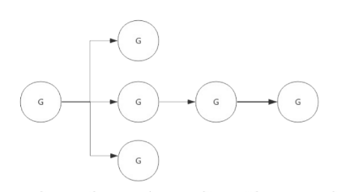

<!-- TOC -->
* [垃圾回收](#垃圾回收)
  * [常见的垃圾回收算法](#常见的垃圾回收算法)
  * [三色标记法](#三色标记法)
  * [STW（Stop The World）](#stwstop-the-world)
  * [写屏障(Write Barrier)](#写屏障write-barrier)
  * [GC 的触发条件？](#gc-的触发条件)
* [context 结构原理](#context-结构原理)
* [竞态、内存逃逸](#竞态内存逃逸)
  * [在 Go 函数中为什么会发生内存泄露？](#在-go-函数中为什么会发生内存泄露)
  * [Goroutine 发生了泄漏如何检测？](#goroutine-发生了泄漏如何检测)
<!-- TOC -->

# 垃圾回收
垃圾回收就是对程序中不再使用的内存资源进行自动回收的操作。
## 常见的垃圾回收算法
* 引用计数：每个对象维护一个引用计数，当被引用对象被创建或被赋值给其他对象时引用计数自动加 +1；如果这个对象被销毁，则计数 -1 ，当计数为 0 时，回收该对象。 
  * 优点：对象可以很快被回收，不会出现内存耗尽或到达阀值才回收。 
  * 缺点：不能很好的处理循环引用 
* 标记-清除：从根变量开始遍历所有引用的对象，引用的对象标记“被引用”，没有被标记的则进行回收。 
  * 优点：解决了引用计数的缺点。 
  * 缺点：需要 STW（stop the world），暂时停止程序运行。 
* 分代收集：按照对象生命周期长短划分不同的代空间，生命周期长的放入老年代，短的放入新生代，不同代有不同的回收算法和回收频率。 
  * 优点：回收性能好 
  * 缺点：算法复杂

## 三色标记法
* 初始状态下所有对象都是白色的。 
* 从根节点开始遍历所有对象，把遍历到的对象变成灰色对象 
* 遍历灰色对象，将灰色对象引用的对象也变成灰色对象，然后将遍历过的灰色对象变成黑色对象。 
* 循环步骤 3，直到灰色对象全部变黑色。 
* 通过写屏障(write-barrier)检测对象有变化，重复以上操作 
* 收集所有白色对象（垃圾）。

## STW（Stop The World）
* 为了避免在 GC 的过程中，对象之间的引用关系发生新的变更，使得 GC 的结果发生错误（如 GC 过程中新增了一个引用，但是由于未扫描到该引用导致将被引用的对象清除了），停止所有正在运行的协程。 
* STW 对性能有一些影响，Golang 目前已经可以做到 1ms 以下的 STW。

## 写屏障(Write Barrier)
* 为了避免 GC 的过程中新修改的引用关系到 GC 的结果发生错误，我们需要进行 STW。但是 STW 会影响程序的性能，所以我们要通过写屏障技术尽可能地缩短 STW 的时间。

## GC 的触发条件？
* 主动触发(手动触发)，通过调用 runtime.GC 来触发 GC，此调用阻塞式地等待当前 GC 运行完毕。
* 被动触发，分为两种方式：
    * 使用系统监控，当超过两分钟没有产生任何 GC 时，强制触发 GC。
    * 使用步调（Pacing）算法，其核心思想是控制内存增长的比例,每次内存分配时检查当前内存分配量是否已达到阈值（环境变量 GOGC）：默认 100%，即当内存扩大一倍时启用 GC。

# context 结构原理
* Context（上下文）是 Golang 应用开发常用的并发控制技术 ，它可以控制一组呈树状结构的 goroutine，每个 goroutine 拥有相同的上下文。Context 是并发安全的，主要是用于控制多个协程之间的协作、取消操作。



* 数据结构: Context 只定义了接口，凡是实现该接口的类都可称为是一种 context。
```go
type Context interface {
   Deadline() (deadline time.Time, ok bool)
   Done() <-chan struct{}
   Err() error
   Value(key interface{}) interface{}
}
```
- [Deadline]方法：可以获取设置的截止时间，返回值 deadline 是截止时间，到了这个时间，Context 会自动发起取消请求，返回值 ok 表示是否设置了截止时间。
- [Done] 方法：返回一个只读的 channel ，类型为 struct{}。如果这个 chan 可以读取，说明已经发出了取消信号，可以做清理操作，然后退出协程，释放资源。当 Done 被关闭时，Err 方法会返回一个非空值。
- [Err] 方法：返回 Context 被取消的原因。
- [Value] 方法：获取 Context 上绑定的值，是一个键值对，通过 key 来获取对应的值。


# 竞态、内存逃逸
* 竞态
    - 资源竞争，就是在程序中，同一块内存同时被多个 goroutine 访问。我们使用 go build、go run、go test 命令时，添加 -race 标识可以检查代码中是否存在资源竞争。
    - 解决这个问题，我们可以给资源进行加锁，让其在同一时刻只能被一个协程来操作。
        - sync.Mutex
        - sync.RWMutex

* 逃逸分析
    - 「逃逸分析」就是程序运行时内存的分配位置(栈或堆)，是由编译器来确定的。堆适合不可预知大小的内存分配。但是为此付出的代价是分配速度较慢，而且会形成内存碎片。
    - 逃逸场景：
        - 指针逃逸
        - 栈空间不足逃逸
        - 动态类型逃逸
        - 闭包引用对象逃逸

## 在 Go 函数中为什么会发生内存泄露？
Goroutine 需要维护执行用户代码的上下文信息，在运行过程中需要消耗一定的内存来保存这类信息，如果一个程序持续不断地产生新的 goroutine，且不结束已经创建的 goroutine 并复用这部分内存，就会造成内存泄漏的现象。

## Goroutine 发生了泄漏如何检测？
* 可以通过 Go 自带的工具 pprof 或者使用 Gops 去检测诊断当前在系统上运行的 Go 进程的占用的资源。 使用 go tool trace 工具

